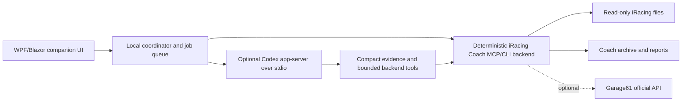

# Companion app build specification

## Version and evidence boundary

This specification describes the current `0.16.0` development source. `0.14.2` remains the latest accepted stable packaged release; the prior 0.15.0 installer is historical simulator-feedback evidence and must not be used as proof of this tree. The current development gates passed 255/255 .NET tests, 247/247 Python tests, 9/9 first-party JavaScript syntax checks, and a Release solution build with zero warnings and zero errors.

Direct real-data browser checks include the August 9 Iowa legacy replay (7,775 frames across five segments) at 1280x720 and 1920x1080 and a real 82-lap analysis with bounded paths/DOM work. The automated synthetic 500-lap case verifies fixed rendering budgets. These are source-development results only; the exact 0.16.0 commit, installer/portable hashes, installed lifecycle, real SDK/high-refresh cadence, and Joshua's acceptance require separate package evidence.

## Product outcome

Build a fast Windows desktop application that lets Joshua use iRacing Coach without opening a general-purpose chat. The deterministic backend must produce a trustworthy result first; optional AI then explains, condenses, researches, or coaches from that evidence.

The four primary workflows are:

1. Race Planning.
2. Race Analysis.
3. Create a Starting Tune.
4. Progressive Tuning.

NASCAR is the first priority, including ovals and road courses, but the data model must not hard-code NASCAR-only assumptions.

## Implementation decision

Use a self-contained Windows x64 application targeting .NET 10 LTS. .NET 10 is an active LTS release through November 2028 according to the [.NET support policy](https://dotnet.microsoft.com/en-us/platform/support/policy). Release one uses C# with a WPF host and Blazor Hybrid views: WPF provides a mature native Windows/process shell, while Blazor Hybrid provides local Razor/CSS/SVG/canvas interaction for the track map and telemetry controls without a web server or WebAssembly. Microsoft documents [Blazor Hybrid for WPF](https://learn.microsoft.com/en-us/aspnet/core/blazor/hybrid/?view=aspnetcore-10.0).

Keep the existing Python backend. Rewriting tested telemetry analysis in another language is not a release-one optimization. A native WPF fallback is acceptable only after a measured Hybrid/WebView blocker; any other stack deviation must document a concrete improvement in delivery time, runtime behavior, or packaging and preserve every contract and acceptance test. Pin all build dependencies and ship the .NET runtime, compatible Python backend runtime, and an explicit WebView2 runtime/bootstrap policy so the racing PC needs no development toolchain.

## Architecture

Boundary rules:

- The UI owns navigation, forms, charts, notifications, and UI-only state.
- The coordinator owns child processes, settings, cancellation, job deduplication, view models, and resumable workflow state.
- The Python backend owns IBT parsing, calculations, archives, setup/tuning history, and Garage61 credentials/API calls.
- Codex owns optional synthesis and research guidance. It never becomes the source of telemetry values or mutates raw iRacing/setup artifacts.

Use stdio for both local backend processes. Do not open a localhost HTTP port for the initial release.

## Visual system

The binding visual specification is `UI_DESIGN_SYSTEM.md`; the machine-readable token source is `config/theme.dark.json`. The app is dark-only for release one: neutral high-contrast graphite layers, softened readable text, a user-selected interaction color, and controlled vivid color for telemetry, selection, evidence, and warnings. It should feel like focused race-engineering software with restrained modern desktop polish. Avoid green-on-green surfaces, pure-black chart wells, low-contrast sameness, glow-heavy neon decoration, generic Bootstrap styling, and dense walls of identical cards. Vivid semantic traces and selected states are intentional; decorative glow is not.

Generate CSS custom properties and any WPF resource equivalents from the token file so native and Hybrid surfaces remain identical. The look may share Codex's calm workspace atmosphere but must use original layout, components, icons, and branding.

## Navigation and screens

### Home

- Backend, Codex, Garage61, source-root, and archive-root health.
- Recent Race sessions with track, car, date, fixed/open, analyzed state, and interruption badge.
- Primary actions: Analyze Race, Plan Race, Build Setup, Continue Tuning.
- Background-job tray with elapsed time, current stage, cancel, retry, and artifact links.

### Race Analysis

- Use one compact event header with `Telemetry`, `Technical data`, and `Race replay`; replacing the former section set must not leave a second legacy review surface.
- Telemetry combines a cursor-synchronized exact-configuration track map, one-row Laps and runs list, and globally portable named trace layouts. Track/Laps visibility, the shared splitter, cursor-centered zoom, one-pixel individual traces, literal selected-lap spread, and the Customize toolbox must preserve state and remain bounded at high lap counts.
- Technical data opens as a fixed two-by-two overview containing `Pit strategy`, `Tire management`, `Fuel management`, and `Racecraft & pace`. Opening a category changes presentation depth rather than substituting unrelated facts; all supported findings remain available in its full-area investigation.
- Race replay is a read-only reconstruction from recorded position/scoring/event/player evidence, not video and not an iRacing `.rpy` player. It uses one shared clock and one flag-colored seek rail across the map, participants, running order, events, comparison, and player telemetry.
- Runs affected by repairs, tow, cautions, pit traffic, or unsupported evidence remain truthfully gated from clean comparisons and targets. Incident counters do not identify semantic cause unless an explicit source event supplies it.
- Keep provenance and evidence status in the underlying contracts and diagnostic detail, while normal driving surfaces lead with conclusions, values, actions, and concise unavailable states instead of source-method explanations.

### Race Planning

- Select season, car, exact track layout, fixed/open, and race distance.
- Show cached track/car knowledge, historical fuel range, caution mix, tire history, pit feasibility, prior incidents/repairs, and reusable Garage61 status.
- Produce an all-green plan plus caution-sensitive alternatives and reserve assumptions.
- Never label a strategy optimal unless the required position, pit-loss, rules, uncertainty, and history evidence exists.

### Starting Tune

- Select car, track/layout, Q or race intent, and an exact or donor source setup.
- Show source provenance, filename/header conflicts, hashes, current-season status, tech/dynamic targets, and donor rationale.
- Generate a coaching package only. Never generate or overwrite a simulator-loadable `.sto`.
- Require the user to load/save the setup inside iRacing and run a clean baseline.

### Progressive Tuning

- Fit the workflow without page scrolling: a thin representative-race chooser, a large exact-configuration map in the left two-thirds, and one consolidated evidence/feedback toolbox in the right third.
- Distinguish corner hover from selected-corner emphasis. Selecting a turn opens the active editor in the toolbox, not over the map, and covers Early/Middle/Late Entry/Center/Exit/Whole feedback.
- Make tight/comfortable/loose fast to record graphically. Keep severity and driver confidence visible with plain-language hover explanations; add secondary symptoms and notes through compact icon actions rather than displaying every option initially.
- Allow one highest-priority corner overall. Color-code turns with feedback for the active run phase without displaying a `not assessed` status.
- Keep tire-wear/run evidence and general feedback in the same toolbox, with general feedback and `Begin analysis` anchored at the bottom.
- Analyze the finalized run and display corroborating telemetry separately from the driver's wording. Recommend one supported setup system, expected effect, risk, success criteria, and exact rollback fingerprint.
- A fixed race may be representative driving evidence, but a garage recommendation requires a compatible analyzed open-setup target. Block conclusions for repair/tow-confounded evidence.
- Record improved/unchanged/worse/inconclusive and retain failed experiments.

### Settings and Diagnostics

- Use the Coach folder as the only displayed portable root; derived archives live beneath it rather than appearing as a second user-configured `Coach archive` location. Configure iRacing Documents/installation discovery, packaged Python, Codex availability, and optional Garage61 state where relevant.
- Validate roots before saving and show that raw iRacing/setup files are read-only.
- Provide one human-readable staged `Move or back up PCs` guide that reviews, checks, and then authorizes copying; do not expose internal `portable preferences` or `prepare copy` terminology.
- Render Troubleshooting with the same expandable bar pattern as Connections. Show backend/version/contract compatibility, timings, logs, and a one-click health test inside the expanded content.
- Never display or log credential values.

## Track and tire-age visualization

Provide an interactive exact-configuration track view synchronized with speed, throttle, brake, steering, and optional comparison traces.

- Derive the recorded GPS/telemetry shape only after rejecting sentinel coordinates and implausible auxiliary layers. Otherwise show a normalized distance strip. Never invent geometry or borrow a different configuration.
- The horizontal slider represents only supported phase or green-lap-on-set evidence. If continuous tire-age interpolation is unsupported, snap to observed early/middle/late or fresh/settled/worn states and explain why.
- Color the car/path by speed or selected control. A cursor on the map moves every trace cursor, and vice versa.
- Wheel zoom centers on the pointer and cannot zoom out beyond Fit; the map cursor and labels remain a constant screen size while geometry zooms.
- Keep every logical selected lap even when rendering detail is bounded. Individual traces remain visually distinct while the aggregate colored ribbon represents the literal spatial edges of all selected laps.
- Show observed local values as observations. Show a target trace only when `comparison_quality.status == "usable"`; otherwise show relative coaching and `Exact target unavailable`.
- Display entry speed, minimum speed, brake onset/peak/release, turn-in, throttle pickup, steering work, and groove evidence per load zone/corner when available.
- Directional groove labels require calibrated inside/outside geometry. Uncalibrated path movement remains unlabeled.
- Repair/tow/candidate windows are shaded and excluded from the default target trace.

## Responsiveness and jobs

- Display local deterministic output as soon as it is ready; do not wait for Codex, Garage61, manuals, maps, or images.
- Cached Race Card target: comfortably under one minute; measured backend repeat is normally under one second.
- Uncached post-race, planning, and tuning target: under two minutes end-to-end.
- Starting-package research target: under four minutes.
- A deadline never authorizes fabricated values. Render unavailable and permit a deeper background investigation.
- Long operations must not freeze navigation. Queue, deduplicate, persist, and cancel them. The current MCP server is synchronous; use disposable workers for cancellable jobs as defined in `BACKEND_INTEGRATION.md`.

## Durable state

- Backend artifacts and history remain authoritative for racing data.
- App-owned settings, window state, job state, and thread mappings live under `%LOCALAPPDATA%\iRacingCoach\Companion`.
- Do not use a chat thread as the database.
- Preserve the racing PC archive and settings across upgrades. Publish checksums and support rollback.

## Deferred milestones

- Garage61 activation after API approval and PAT setup.
- Representative real-race validation and cadence instrumentation for the implemented live shared-memory and bounded high-rate replay-capture paths; no raw samples are streamed to AI.
- Optional official results enrichment for final reason-out/field context.
