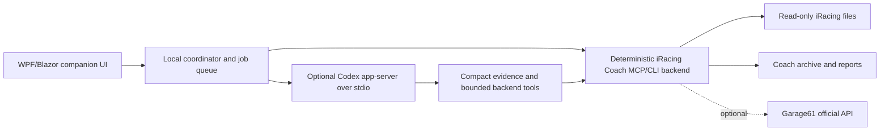

# Companion app build specification

## Product outcome

Build a fast Windows desktop application that lets Joshua use iRacing Coach without opening a general-purpose chat. The deterministic backend must produce a trustworthy result first; optional AI then explains, condenses, researches, or coaches from that evidence.

The four primary workflows are:

1. Race Planning.
2. Race Analysis.
3. Create a Starting Tune.
4. Progressive Tuning.

NASCAR is the first priority, including ovals and road courses, but the data model must not hard-code NASCAR-only assumptions.

## Implementation decision

Use a self-contained Windows x64 application targeting .NET 10 LTS. .NET 10 is an active LTS release through November 2028 according to the [.NET support policy](https://dotnet.microsoft.com/en-us/platform/support/policy). Release one uses C# with a WPF host and Blazor Hybrid views: WPF provides a mature native Windows/process shell, while Blazor Hybrid provides local Razor/CSS/SVG/canvas interaction for the track map and telemetry controls without a web server or WebAssembly. Microsoft documents [Blazor Hybrid for WPF](https://learn.microsoft.com/en-us/aspnet/core/blazor/hybrid/?view=aspnetcore-10.0).

Keep the existing Python backend. Rewriting tested telemetry analysis in another language is not a release-one optimization. A native WPF fallback is acceptable only after a measured Hybrid/WebView blocker; any other stack deviation must document a concrete improvement in delivery time, runtime behavior, or packaging and preserve every contract and acceptance test. Pin all build dependencies and ship the .NET runtime, compatible Python backend runtime, and an explicit WebView2 runtime/bootstrap policy so the racing PC needs no development toolchain.

## Architecture

Boundary rules:

- The UI owns navigation, forms, charts, notifications, and UI-only state.
- The coordinator owns child processes, settings, cancellation, job deduplication, view models, and resumable workflow state.
- The Python backend owns IBT parsing, calculations, archives, setup/tuning history, and Garage61 credentials/API calls.
- Codex owns optional synthesis and research guidance. It never becomes the source of telemetry values or mutates raw iRacing/setup artifacts.

Use stdio for both local backend processes. Do not open a localhost HTTP port for the initial release.

## Visual system

The binding visual specification is `UI_DESIGN_SYSTEM.md`; the machine-readable token source is `config/theme.dark.json`. The app is dark-only for release one: gentle charcoal layers, softened text, restrained blue interaction, and brighter colors reserved for telemetry/evidence. It must not fall back to pure black panels, pure white body text, neon traces, generic Bootstrap styling, or a wall of high-contrast cards.

Generate CSS custom properties and any WPF resource equivalents from the token file so native and Hybrid surfaces remain identical. The look may share Codex's calm workspace atmosphere but must use original layout, components, icons, and branding.

## Navigation and screens

### Home

- Backend, Codex, Garage61, source-root, and archive-root health.
- Recent Race sessions with track, car, date, fixed/open, analyzed state, and interruption badge.
- Primary actions: Analyze Race, Plan Race, Build Setup, Continue Tuning.
- Background-job tray with elapsed time, current stage, cancel, retry, and artifact links.

### Race Analysis

- Show the returned deterministic Race Card immediately.
- Tabs: Overview, Corner Plan, Runs/Tires, Fuel/Strategy, Interruptions, Telemetry, Evidence.
- Overview includes run length, green/caution exposure, pit stops, fuel, tire endpoints, and limitations.
- Interruptions aligns incident-point changes, pit-road transit, stall occupancy, service-active spans, mandatory/optional repair countdowns, tow, and fast-repair confirmation. Overlapping clocks must be drawn in parallel, never added.
- Affected laps/runs receive a visible repair-confounded badge and are excluded from clean trendlines and target generation by default. Provide a diagnostic include toggle.
- Every claim retains `[M]`, `[D]`, `[I]`, `[P]`, or `[U]` evidence status.

### Race Planning

- Select season, car, exact track layout, fixed/open, and race distance.
- Show cached track/car knowledge, historical fuel range, caution mix, tire history, pit feasibility, prior incidents/repairs, and reusable Garage61 status.
- Produce an all-green plan plus caution-sensitive alternatives and reserve assumptions.
- Never label a strategy optimal unless the required position, pit-loss, rules, uncertainty, and history evidence exists.

### Starting Tune

- Select car, track/layout, Q or race intent, and an exact or donor source setup.
- Show source provenance, filename/header conflicts, hashes, current-season status, tech/dynamic targets, and donor rationale.
- Generate a coaching package only. Never generate or overwrite a simulator-loadable `.sto`.
- Require the user to load/save the setup inside iRacing and run a clean baseline.

### Progressive Tuning

- Capture the driver's own entry/center/exit, transient/long-run, tight/loose/bottoming/bump/traction description.
- Analyze the finalized run and display corroborating telemetry separately from the symptom.
- Recommend one setup system, expected effect, risk, success criteria, and exact rollback fingerprint.
- Block setup conclusions for fixed sessions or repair/tow-affected evidence.
- Record improved/worse/no-change/inconclusive and retain failed experiments.

### Settings and Diagnostics

- Configure iRacing root, coach archive root, packaged Python, Codex availability, and optional Garage61 state.
- Validate roots before saving and show that raw iRacing/setup files are read-only.
- Show backend/version/contract compatibility, timings, logs, and a one-click health test.
- Never display or log credential values.

## Track and tire-age visualization

Provide an interactive track view synchronized with speed, throttle, brake, steering, and optional comparison traces.

- Draw recorded GPS/telemetry shape when available; otherwise show a normalized distance strip. Never invent geometry.
- The horizontal slider represents only supported phase or green-lap-on-set evidence. If continuous tire-age interpolation is unsupported, snap to observed early/middle/late or fresh/settled/worn states and explain why.
- Color the car/path by speed or selected control. A cursor on the map moves every trace cursor, and vice versa.
- Show observed local values as observations. Show a target trace only when `comparison_quality.status == "usable"`; otherwise show relative coaching and `Exact target unavailable`.
- Display entry speed, minimum speed, brake onset/peak/release, turn-in, throttle pickup, steering work, and groove evidence per load zone/corner when available.
- Directional groove labels require calibrated inside/outside geometry. Uncalibrated path movement remains unlabeled.
- Repair/tow/candidate windows are shaded and excluded from the default target trace.

## Responsiveness and jobs

- Display local deterministic output as soon as it is ready; do not wait for Codex, Garage61, manuals, maps, or images.
- Cached Race Card target: comfortably under one minute; measured backend repeat is normally under one second.
- Uncached post-race, planning, and tuning target: under two minutes end-to-end.
- Starting-package research target: under four minutes.
- A deadline never authorizes fabricated values. Render unavailable and permit a deeper background investigation.
- Long operations must not freeze navigation. Queue, deduplicate, persist, and cancel them. The current MCP server is synchronous; use disposable workers for cancellable jobs as defined in `BACKEND_INTEGRATION.md`.

## Durable state

- Backend artifacts and history remain authoritative for racing data.
- App-owned settings, window state, job state, and thread mappings live under `%LOCALAPPDATA%\iRacingCoach\Companion`.
- Do not use a chat thread as the database.
- Preserve the racing PC archive and settings across upgrades. Publish checksums and support rollback.

## Deferred milestones

- Garage61 activation after API approval and PAT setup.
- Semi-live IRSDK shared-memory sidecar, updating locally by lap block/pit stop rather than streaming raw samples to AI.
- Optional official results enrichment for final reason-out/field context.
